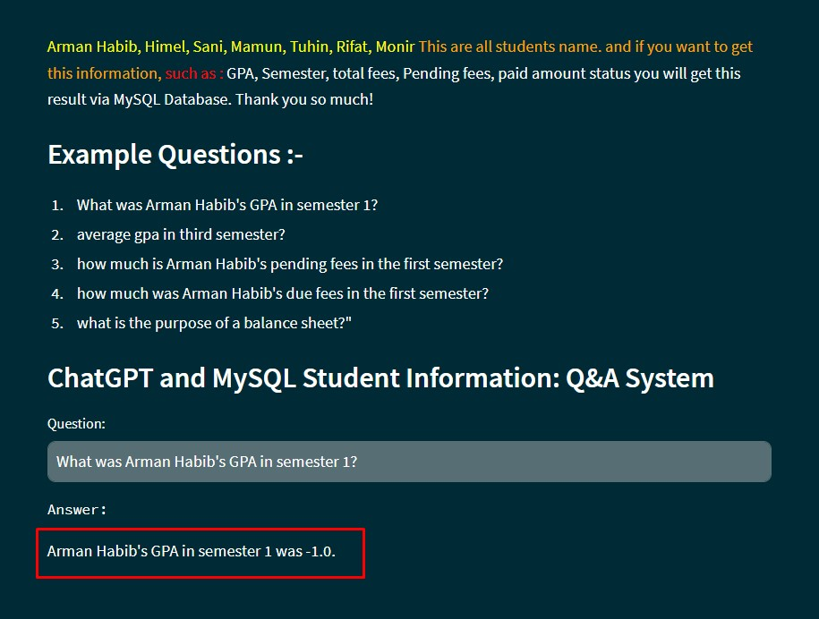

# OpenAI Function Calling
### ChatGPT and MySQL - Student Information: Q&A System



Build a system that can take input question related to a database of College. Here are some sample questions you can ask to this Q&A system.


### Sample questions

1. What was Arman Habib's GPA in semester 1?
   1. This should return "pending" fees 
1. how much is Arman Habib's pending fees in the first semester?
   1. This should return "paid" fees
1. What is the purpose of a balance sheet?.
   1. This is not a question related to college's internal data. It is rather a general question that openai LLM can answer using its past training (similar to ChatGPT)
1. average gpa in third semester?
   1. This will return an average GPA of all the students in the third semester

## Tech Stack

```commandline
Database: MySQL
Backend: Python + OpenAI Function Calling
Frontend: Streamlit
```

## Set Up

1. Database: In db, directory you will see sql file. Just run that entire script in your MySQL workbench
2. Python code: You need to install following modules,
   ```commandline
   pip install openai
   pip install streamlit
   pip install mysql-connector-python
   ```
3. OpenAI setup: You need to obtain a secret key from  your openai account and put it in secret_key.py file 

## Running streamlit app

From your command line run this command,
```commandline
streamlit run main.py
```
